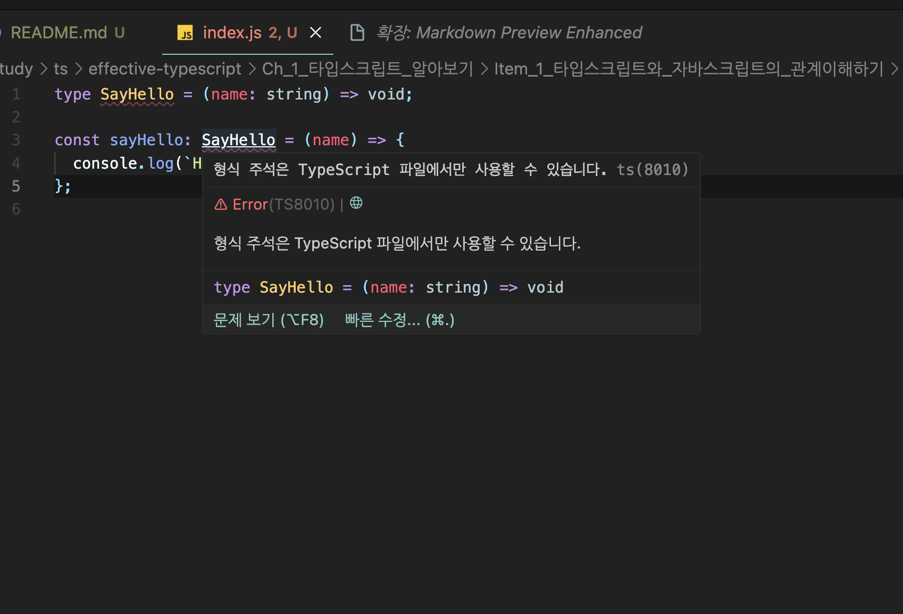
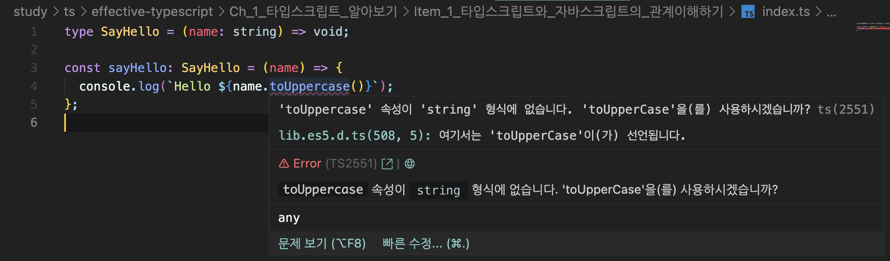

# Item_1. 타입스크립트와 자바스크립트의 관계

> 타입스크립트는 자바스크립트의 superset이다

### 슈퍼셋이란?

    슈퍼셋(Superset)은 집합론에서 사용되는 개념으로, 어떤 집합이 다른 집합을 포함하는 관계를 나타냅니다. 즉, A 집합이 B 집합의 모든 요소를 포함하면 A를 B의 슈퍼셋이라고 합니다.


```javascript
//index.js
const sayHello = (name) => {
  console.log(`Hello ${name}`);
};
sayHello("sejong");
```

TS는 JS를 포함하고있기에, JS확장자를 TS로 변경해도 사용이 가능하다.
즉 위 js 코드는 이미 타입스크립트라고 할 수 있다.

```typescript
//index.ts
const sayHello = (name) => {
  console.log(`Hello ${name}`);
};
sayHello("sejong");
```

이러한 특성때문에 기존 js로 작성된 프로젝트를 ts로 마이그레이션하는데에 많은 이점이있다.

위 간단한 코드를 다른 언어로 마이그레이션해보겠다.

<br>

### js -> c 마이그레이션

```c
#include <stdio.h>

void sayHello(const char *name) {
    printf("Hello %s\n", name);
}

int main() {
    sayHello("sejong");
    return 0;
}
```

<br>

### js -> jave 마이그레이션

```java
public class Main {

    public static void sayHello(String name) {
        System.out.println("Hello " + name);
    }

    public static void main(String[] args) {
        sayHello("sejong");
    }
}

```

js와 c, java는 문법이 전혀 다르기에 코드를 새로작성해야한다.

하지만 TS로 마이그레이션 할때에는 파일 확장자면 js->ts로 바꿔줘도 작동한다.

```js
//main.js => main.ts
```

<br>

> 하지만, 모든 TS는 JS가 아니다.

아래 이러한 TS코드가 있다고하자.

이 파일의 확장자를 js로 바꾸면

```ts
// index.js
type SayHello = (name: string) => void;

const sayHello: SayHello = (name) => {
  console.log(`Hello ${name}`);
};
```



이러한 오류를 발견 할 수있다.

코드안에 있는 type은 ts의 문법이기 때문에 에러가 에러가 나는것이다.

### **_다시 돌아가서, js->ts로 마이그레이션 할때의 용이한 점을 추가적으로 알아보자_**

<br>




위와같이 코드상의 문제를 typechecker가 잡아준다.

### 타입스크립트 타입 시스템은 자바스크립트의 런타임 동작을 '모델링' 한다


```ts
const x = 2 + "2"; //정상 string 
const y = "2" + 2; //정상 string

const a = null + 7; // 자바스크립트에서는 a = 7,
// ts -> '+' 연산자를 null형식에 적용 할 수 없습니다.

const b = [] + 12; // 자바스크립트에서는 b = 12
//  [] + 불가...

alert('hi','babo')
// 0-1개 인수가 필요한데, 2개 가져옴....
```


## 요약
- 타입스크립트는 자바스크리트의 상위 집합이다. 다시 말해, 모든 자바스크립트 프로그램은 이미 타입스크립트 프로그램이다. 반대로, 타입스크립트는 별도의 문법을 가지고 있기 때문에 일반적으로는 유효한 자바스크립트 프로그램이 아니다.

- 타입스크립트는 자바스크립트 런타임 동작을 모델링하는 타입 시스템을 가지고 있기 대문에 런타임 오류를 발생시키는 코드를 찾아내려고 한다. 그러나 모든 오류를 찾아내리라 기대하면 안된다. 타입 체커를 통과하면서도 런타임 오류를 발생시키는 코드는 출분히 존재한다.

- 타입스크립트 타임 시스템은 전반적으로 자바스크립트 동작을 모델링한다. 그러나 잘못된 매개변수 개수로 함수를 호출하는 경우처럼, 자바스크립트에서는 허용되지만, 타입스크립트에서는 문제가 되는 경우도 있다. 이러한 문법의 엄격함은 온전히 취향의 차이이며 우열을 가릴 수 없는 문제이다. (하지만, 여러명에서 같이 코드를 작성하는경우와 프로젝트가 큰경우에는 업격한 것이 생산성이 더욱 좋다.)


