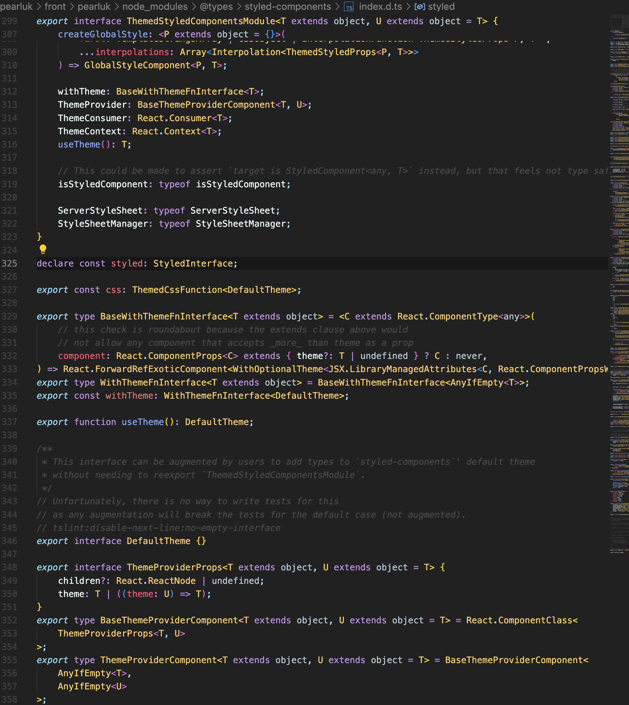
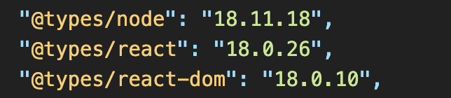

# Item_6 폊집기를 사용하여 타입시스템 탐색하기

타입스크립트를 설치하면,

- 타입스크립트 컴파일러 (tsc)
- 타입스크립트 서버 (tsserver)

실행가능

### 타입스크립트 서버

- 언어 서비스 제공
  - 코드 자동 완성
  - 명세 검사
  - 검색
    리팩토링

IDE에서 제공하는 언어 서비스를 적극 이용해야 협업에 용이함

### 참고

라이브러리의 타입시스템을 이용하기위해서는
d.ts가 필요함
d.ts파일은 타입 선언 파일임

아래와 같이 @types/lib는 lib의 타입선언 파일을 install하는 것임
만약 라이브러리를 install하였는데 타입추론이 되지 않는 경우, 그 라이브러리가 ts를 지원하는지 찾아보고
@types를 설치해보자.

